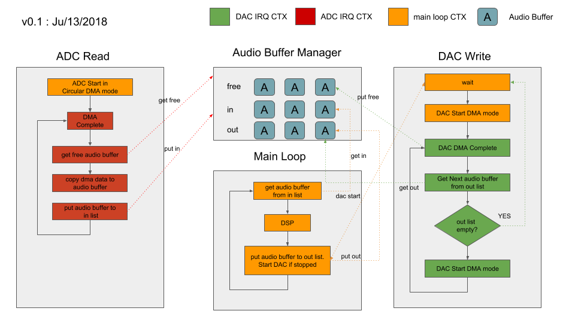
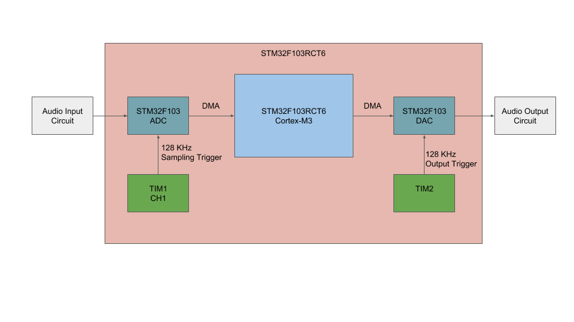
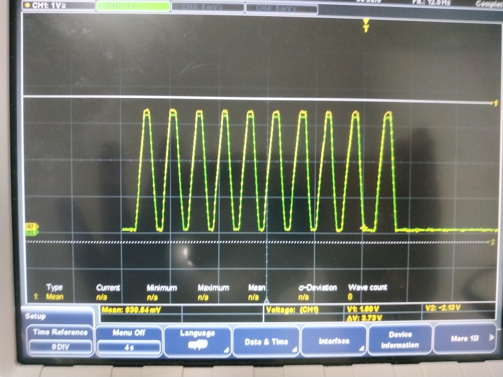
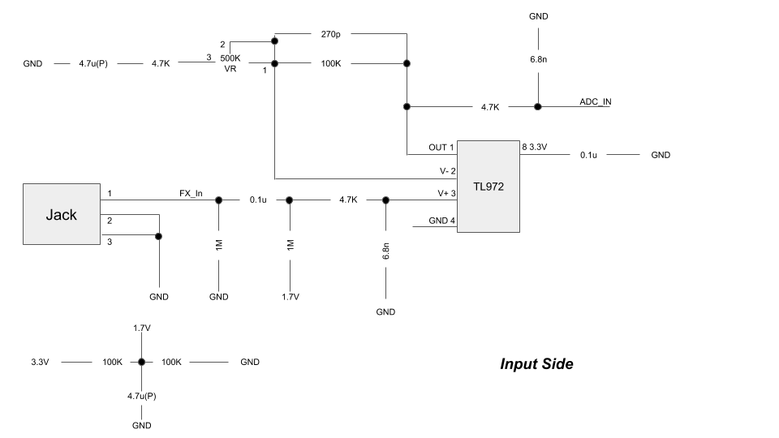
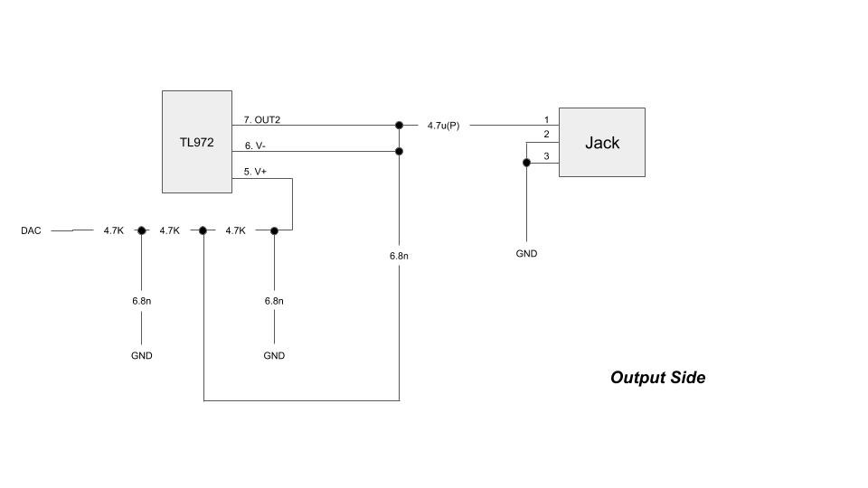
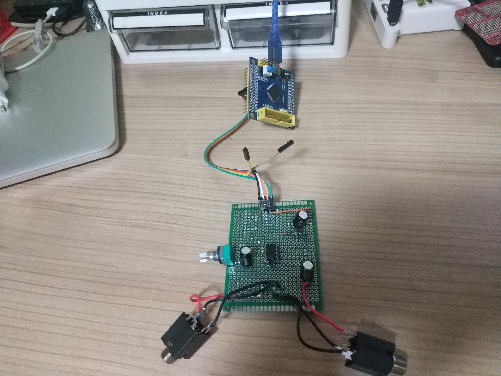
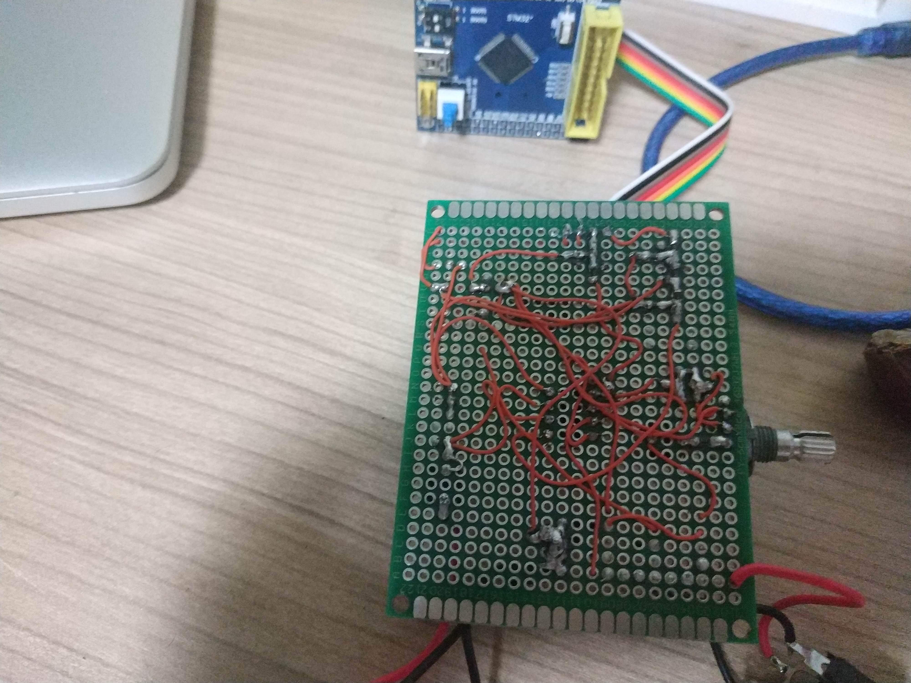

# stm32f103rct6_audio

!!! work still in progress at very early stage!!!

This is a simple audio processor based on stm32f1 as my hobby project.

## Current Architecture

## Current Status
15th, August, 2018

All right. With oscilloscope at work, I was able to verify Input/Output.
In the picture below, yellow is ADC input and green is DAC output.

11th, August, 2018.

Since I don't have an oscilloscope, I couldn't precisely verify all the input/output graphs and their timings.
But with test meter and potentiometer, I was able to verify that the output voltage matches the input voltage.
The next phase is to design audio I/O circuit and apply DSP.

3th, October, 2018.

It's been while since last time I worked on this hobby project.

The input/outside schematic is ready and it is basically just a copy of [electrosmash](https://www.electrosmash.com/pedalshield-uno).

And here is the schematic.

Input side is just an
1. offset biasing around 1.7V since guitar input is around 0V.
2. amplification using TL972 opamp for ADC.

1. just output stabilization using TL972 opamp.

And here is the demo board connected to a cheap stm32f103rct6 board.

And you know what? It sounds not that bad!
Now is the time to study DSP a bit.
